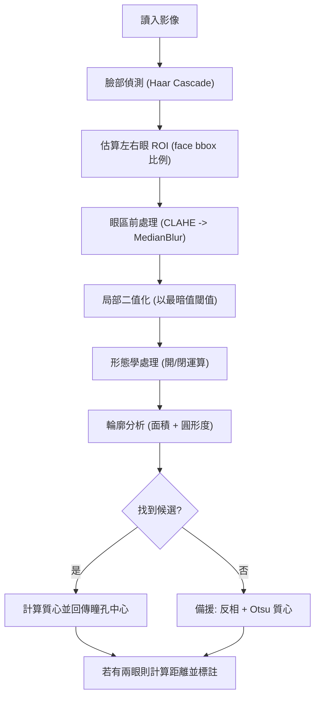

# Pupil Detection

## 專案概述

- 輸出：帶註記的影像（將瞳孔中心與連線標出）、以及回傳的偵測結果（JSON-like 結構顯示臉框、瞳孔座標、距離）。

## 快速開始

1. 建議先建立 conda 環境（你可使用相同名稱 `Pupil_Detection`）：

```bash
conda activate Pupil_Detection
```

```bash
pip install -r Pupil_Detection/requirements.txt
```

```bash
python Pupil_Detection/pupil_detection.py --image Pupil_Detection/test_image/image1.png --output Pupil_Detection/results/image1_annotated_debug.jpg
```

## 檔案結構

- `Pupil_Detection/README.md` : 專案簡要說明。

簡短說明：在單張靜態影像內偵測人臉的瞳孔中心並計算左右瞳孔中心之間的像素距離。此 README 已整理為適合公開上傳的格式，包含快速開始、使用範例、技術清單、處理流程與注意事項。

- 臉部偵測：使用 OpenCV 的 Haar cascade (`haarcascade_frontalface_default.xml`) 偵測臉部 bounding box。
- 鎖定眼區：以 face bbox 比例估算左右眼 ROI（避免直接使用 Haar eye 偵測誤判）。
- 瞳孔定位：在每個眼部 ROI 進行 CLAHE 增強與中值濾波，接著以最暗值為基準做局部二值化與形態學處理，擷取可能的暗色輪廓，使用面積與圓形度選出最佳候選；若候選不足則以反相+Otsu 的質心作為備援。
- 距離計算：若一張臉找到兩瞳孔中心，計算兩者之歐式距離並在影像上標註（像素）。

### 技術清單

- **OpenCV (haarcascade, image ops)**: 臉部偵測、影像前處理、輪廓與繪製。
- **CLAHE (局部對比增強)**: 提升眼區局部對比，對於低對比影像特別有用。
- **Median blur**: 抑制椒鹽雜訊，保留邊緣資訊。
- **Thresholding (min-value / Otsu)**: 分割瞳孔（暗區）與背景；min-value 作為主要策略，Otsu 作為備援。
- **Morphological ops (open/close)**: 移除小雜訊與填補小孔洞，提高輪廓穩定性。
- **Contour analysis (area + circularity)**: 以面積與圓形度評分候選瞳孔輪廓。
- **Moments (質心)**: 當輪廓不足時，以質心作為瞳孔近似中心。
- **歐式距離**: 計算左右瞳孔中心的像素距離。

## 處理流程（流程圖與步驟）



步驟簡述：

1. 讀入影像並轉為灰階。
2. 使用 Haar cascade 偵測臉部 bounding box。
3. 根據臉框比例估算左右眼 ROI，限定搜尋區域以降低誤偵測。
4. 在每個眼區進行 CLAHE 與中值濾波增強與去噪。
5. 以最暗值為基準做局部二值化，接著用形態學處理清理雜訊。
6. 使用輪廓分析（面積與圓形度）挑選最可能的瞳孔區，並取質心為中心點；若無候選則以反相+Otsu 質心作為備援。
7. 若在同一臉上取得左右兩瞳孔中心，計算歐式距離並在影像上標註。

## 輸出範例與解釋

- 程式會回傳每個偵測到的臉的結果（`face_box`, `pupil_centers`, `distance_px`）。
- 標記說明：
  - 綠色圓：瞳孔外圍估計
  - 紅色點：瞳孔中心
  - 藍色線：兩瞳孔中心連線
  - 橙色矩形：未找到瞳孔時顯示的眼區

---

## 成果 (Results)

註：下列連結與圖片指向已推至你的 GitHub repository。

- image1_annotated.jpg

  

  https://github.com/hank921109/114-2-Pupil_Detection/blob/main/results/image1_annotated.jpg

- image2_annotated.jpg

  

  https://github.com/hank921109/114-2-Pupil_Detection/blob/main/results/image2_annotated.jpg

---

## 輸出範例與解釋

- 程式會在終端列印偵測結果陣列（每個臉的 `face_box`, `pupil_centers`, `distance_px`）。
- 標記顏色說明（預設）：
  - 綠色圓：估計到的瞳孔半徑與外框
  - 紅色點：瞳孔中心
  - 藍色線：兩瞳孔中心連線（若找到兩顆瞳孔）
  - 橙色框：眼睛 ROI（當無法定位瞳孔時顯示）

範例終端輸出（示意）：

```text
Results:
{'face_box': (120, 80, 220, 220), 'pupil_centers': [(160, 150), (240, 152)], 'distance_px': 80.25}
```

在 GitHub 的 README 或技術文件中可加入 sample 資料夾與結果影像，方便 reviewer 或使用者快速檢視成果。

## 測試與評估

- 建議測試集：包含不同光照、戴眼鏡/不戴眼鏡、不同視角（±30°）、不同年齡與人種的樣本。
- 評估指標：
  - 檢出率（瞳孔中心是否被正確偵測）
  - 平均中心誤差（若有標註真實中心）
  - 偵測失敗情境統計（遮擋、反光、極端側臉）

## 限制與注意事項

- Haar cascade 對大角度側臉或遮擋（例如頭髮、手）表現差。
- 眼鏡反光、強烈側光或太暗環境會造成 HoughCircles / 二值化失效。
- 本程式輸出為像素距離，若要取得實際毫米或公分需進行相機內參/外參校正或使用已知尺度。

## 未來改進方向

- 使用深度學習的人臉關鍵點 (facial landmark) 模型（如 dlib、mediapipe、或基於 CNN 的 landmark 檢測）提高對於側臉與遮擋的健壯性。
- 加入亮度/反光偵測與專門的反光移除預處理。
- 加入相機校正流程與標定工具，使像素距離能換算為實際長度。
- 加入單元測試與評估腳本，並提供範例資料與標註檔。

## 參考與資源

- OpenCV Haar Cascades: https://docs.opencv.org/
- Hough Circle Transform: https://docs.opencv.org/4.x/da/d53/tutorial_py_houghcircles.html

---
