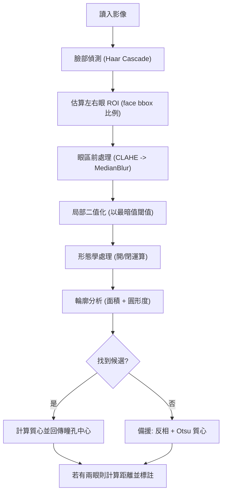

# Pupil Detection

## 專案概述

- 輸出：帶註記的影像（將瞳孔中心與連線標出）、以及回傳的偵測結果（JSON-like 結構顯示臉框、瞳孔座標、距離）。
## 快速開始

1. 建議先建立 conda 環境（你可使用相同名稱 `Pupil_Detection`）：

```bash
conda activate Pupil_Detection
```


```bash
pip install -r Pupil_Detection/requirements.txt
```


```bash
python Pupil_Detection/pupil_detection.py --image Pupil_Detection/test_image/image1.png --output Pupil_Detection/results/image1_annotated_debug.jpg
```

## 檔案結構

- `Pupil_Detection/README.md` : 專案簡要說明。

簡短說明：在單張靜態影像內偵測人臉的瞳孔中心並計算左右瞳孔中心之間的像素距離。此 README 已整理為適合公開上傳的格式，包含快速開始、使用範例、技術清單、處理流程與注意事項。

- 臉部偵測：使用 OpenCV 的 Haar cascade (`haarcascade_frontalface_default.xml`) 偵測臉部 bounding box。
- 鎖定眼區：以 face bbox 比例估算左右眼 ROI（避免直接使用 Haar eye 偵測誤判）。
- 瞳孔定位：在每個眼部 ROI 進行 CLAHE 增強與中值濾波，接著以最暗值為基準做局部二值化與形態學處理，擷取可能的暗色輪廓，使用面積與圓形度選出最佳候選；若候選不足則以反相+Otsu 的質心作為備援。
- 距離計算：若一張臉找到兩瞳孔中心，計算兩者之歐式距離並在影像上標註（像素）。

### 技術清單

- **OpenCV (haarcascade, image ops)**: 臉部偵測、影像前處理、輪廓與繪製。
- **CLAHE (局部對比增強)**: 提升眼區局部對比，對於低對比影像特別有用。
- **Median blur**: 抑制椒鹽雜訊，保留邊緣資訊。
- **Thresholding (min-value / Otsu)**: 分割瞳孔（暗區）與背景；min-value 作為主要策略，Otsu 作為備援。
- **Morphological ops (open/close)**: 移除小雜訊與填補小孔洞，提高輪廓穩定性。
- **Contour analysis (area + circularity)**: 以面積與圓形度評分候選瞳孔輪廓。
- **Moments (質心)**: 當輪廓不足時，以質心作為瞳孔近似中心。
- **歐式距離**: 計算左右瞳孔中心的像素距離。

## 處理流程（流程圖與步驟）



步驟簡述：

1. 讀入影像並轉為灰階。
2. 使用 Haar cascade 偵測臉部 bounding box。
3. 根據臉框比例估算左右眼 ROI，限定搜尋區域以降低誤偵測。
4. 在每個眼區進行 CLAHE 與中值濾波增強與去噪。
5. 以最暗值為基準做局部二值化，接著用形態學處理清理雜訊。
6. 使用輪廓分析（面積與圓形度）挑選最可能的瞳孔區，並取質心為中心點；若無候選則以反相+Otsu 質心作為備援。
7. 若在同一臉上取得左右兩瞳孔中心，計算歐式距離並在影像上標註。

## 輸出範例與解釋

- 程式會回傳每個偵測到的臉的結果（`face_box`, `pupil_centers`, `distance_px`）。
- 標記說明：
  - 綠色圓：瞳孔外圍估計
  - 紅色點：瞳孔中心
  - 藍色線：兩瞳孔中心連線
  - 橙色矩形：未找到瞳孔時顯示的眼區

## 測試與評估

- 建議使用多樣化測試集（光照、眼鏡、角度）。
- 評估：檢出率、平均中心誤差、失敗案例統計。

## 限制與注意事項

- Haar face 在極側臉或遮擋下會降低準確性。
- 強烈反光或眼鏡會影響二值化與輪廓方法。
- 輸出的距離為像素，若需實際尺寸請做相機校正或使用已知尺度換算。

## 未來改進方向

- 改用 `mediapipe` 或 `dlib` 的 face landmark，提高眼區定位與遮擋容忍度。
- 加入反光偵測與移除的前處理。
- 提供簡單的 calibration 腳本，把像素距離換算為實際長度（mm）。

## 中間產物（Debug）

當你指定 `--output` 時，程式會在輸出資料夾下建立 `intermediates/<basename>/`，存放每張臉和每隻眼的中間影像：

- `<prefix>_roi_color.png` : 原始眼部彩圖 ROI
- `<prefix>_gray.png` : 眼部灰階圖
- `<prefix>_clahe_median.png` : CLAHE + median 後的影像
- `<prefix>_th.png` : 基於最暗值的二值化結果
- `<prefix>_inv.png` / `<prefix>_inv_th.png` : 反相與 Otsu 二值（fallback）

這些檔案有助於逐步檢視與參數調校。

## 在終端機中執行（使用 conda）

若你已建立且啟動 conda 環境 `Pupil_Detection`：

```bash
conda activate Pupil_Detection
pip install -r Pupil_Detection/requirements.txt
python Pupil_Detection/pupil_detection.py --image Pupil_Detection/test_image/image1.png --output Pupil_Detection/results/image1_annotated_debug.jpg
ls -l Pupil_Detection/results/intermediates/image1_annotated_debug
```

對整個資料夾批次處理：

```bash
mkdir -p Pupil_Detection/results
for f in Pupil_Detection/test_image/*; do
  out="Pupil_Detection/results/$(basename "${f%.*}")_annotated_debug.jpg"
  python Pupil_Detection/pupil_detection.py --image "$f" --output "$out"
done
```

如果你不想 activate 環境，可使用：

```bash
conda run -n Pupil_Detection python Pupil_Detection/pupil_detection.py --image Pupil_Detection/test_image/image1.png --output Pupil_Detection/results/image1_annotated_debug.jpg
```bash


## 成果展示
[成果1](https://github.com/hank921109/114-2-Pupil_Detection/blob/main/results/image1_annotated.jpg)
[成果2](https://github.com/hank921109/114-2-Pupil_Detection/blob/main/results/image2_annotated.jpg)


## 參考與資源

- OpenCV Haar Cascades: https://docs.opencv.org/
- Hough Circle Transform: https://docs.opencv.org/4.x/da/d53/tutorial_py_houghcircles.html

---
